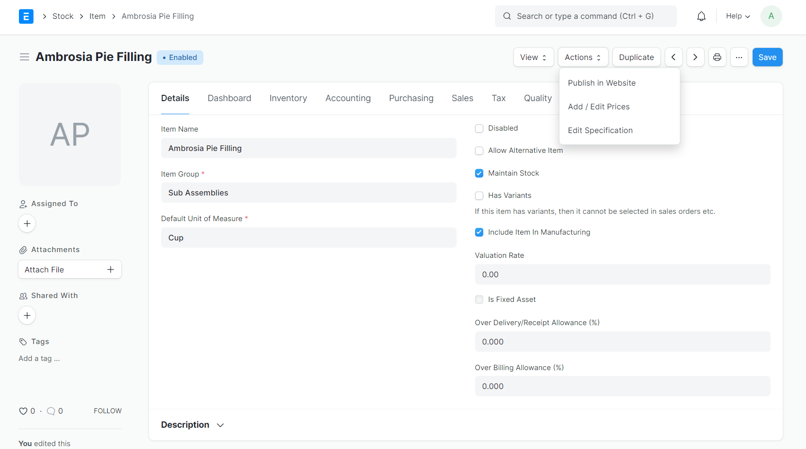
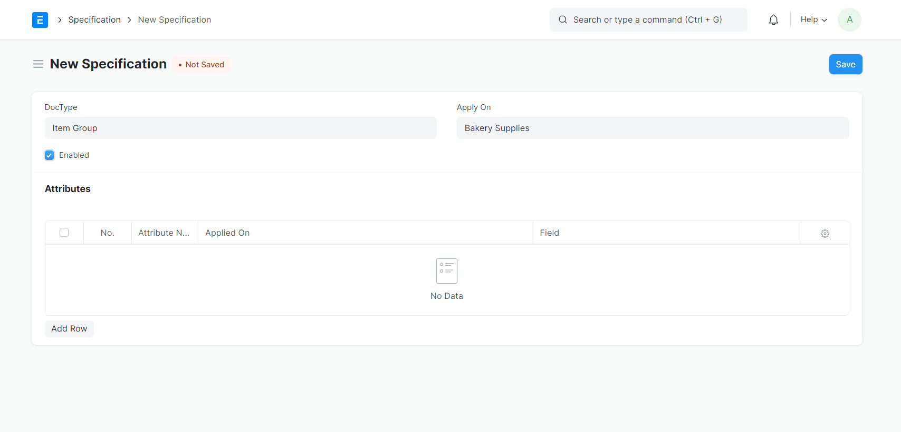
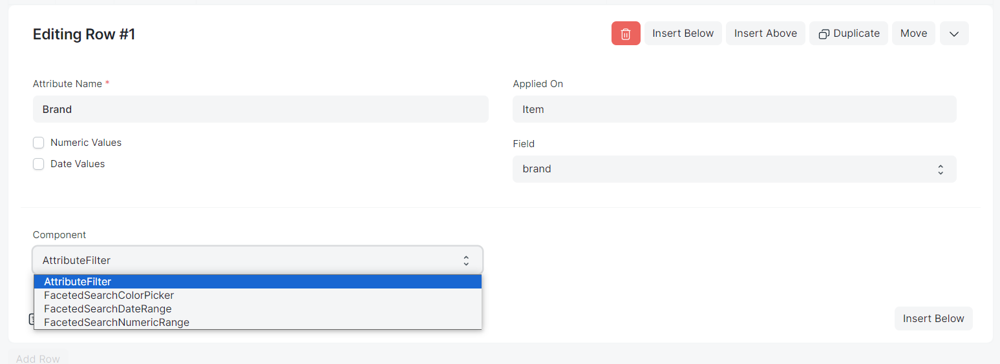
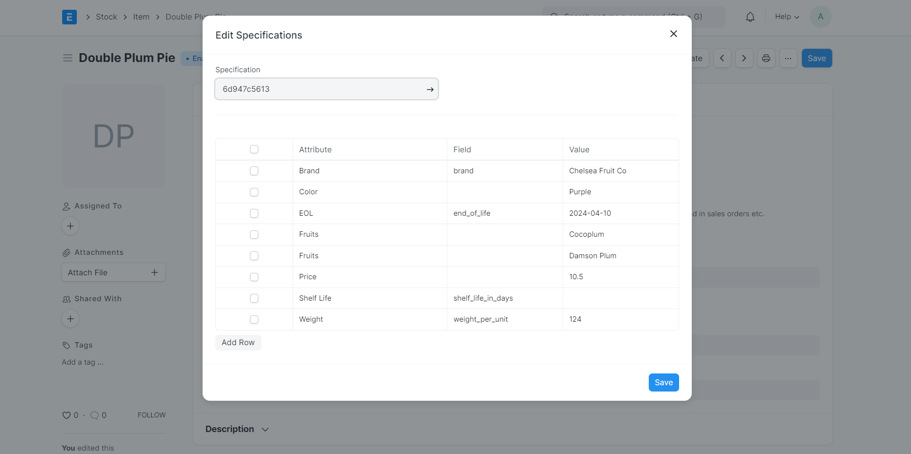

# Faceted Search

An Inventory Tools for ERPNext. This allows user to list their product under `/all-products` and filter them with their specification

# Manual Setup

Follow the steps to create your first listed product which allows multiple specification and it's variations.

### Steps:

1. Create New Item:
   Route through `Stock` > `Item` > `Add Item` and fillup all necessary details > `Save`
   
3. Add Item to Website Item:
   On Item page click `Actions` (Top Right) >  Click `Publish in Website`

5. Create Specifications for the Item:
   1. Type `Specification` in Awesomebar > `Add Specification`.
   2. Select `DocType` on which you would like to customize the specification.
   3. Select `Apply On` based on the doctype.
   4. Mark it `Enabled`.

   5. Under `Attributes` table click `Add Row` > `Edit`.

      - Write unique `Attribute Name`.
      - Choose if the value is expected to be a `Date Value` or `Numeric Value`.
      - Select `Apply On` (In this case, we can choose `Item`).
      - Select the `Field` on which this should be applied (Can be left empty).
      - Choose `Component` based one following explainations:
        
          1. `FacetedSearchColorPicker` If the Attribute is related to the colors.
          2. `FacetedSearchDateRange` If the Attribute is related to the Date values.
          3. `FacetedSearchNumericRange` If the Attribute is related to the Numeric values.
          4. `AttributeFilter` If any other the mentioned above.

      - `Save` Specifications.
7. Create `Specification Values`:
   - Route through `Stock` > `Item` > Choose Item.
   - On Item page click `Actions` (Top Right) >  Click `Edit Specification` (This will prepopulate the specifications based on your selection, If not please select from the dropdown)
   - `Save`

This is how you can create and manage your specification. you can go to `/all-products`, you will see listed Item and Filter(s) on left.

### Note:
`Specification` and `Specification Values` are reusable as far as the grouping of Items are done correctly, you may want to create new specification for different type goods.