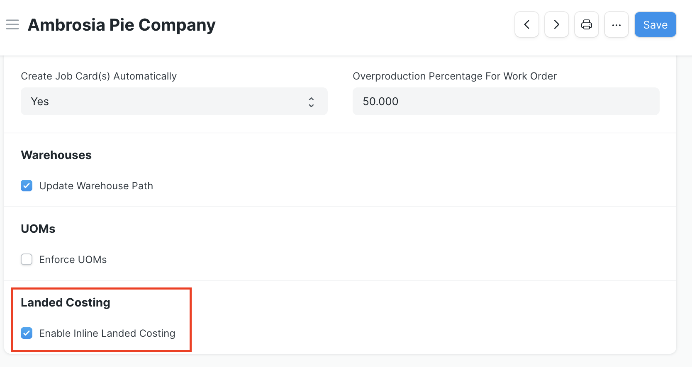
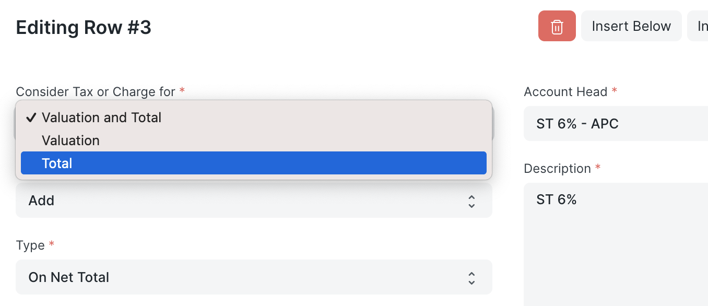
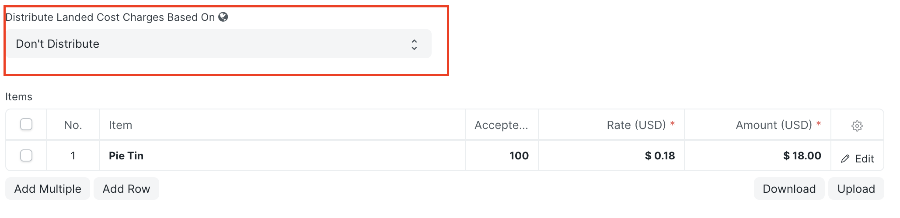

# Inline Landed Costing

This features enables a user to directly include any additional costs to be capitalized into an Item's valuation in a Purchase Receipt or Purchase Invoice without needing to create a separate Landed Cost Voucher.

By default, this feature is turned off, but may be toggled on by checking the Enable Inline Landed Costing checkbox in the Landed Costing Section in the Inventory Tools Settings document. As with all Inventory Tools Settings, these are set on a per-company basis.

When the feature is on, the Purchase Receipt and Purchase Invoice documents will show an additional dropdown field called Distribute Landed Cost Charges Based On above the Items table. If there are no landed costs in the document, then the default Don't Distribute should remain selected. To include and distribute landed costs, the landed costs should be entered as row(s) into the Purchase Taxes and Charges table. The method to distribute landed costs may be based on the relative items' Qty or Amount.

Note that including landed costs in an item's valuation only works when it is marked as an asset or stock item in its Item master.

The feature assumes all rows in the Purchase Taxes and Charges table should be included and distributed as landed costs. If there are any rows that should be excluded (such as sales tax or a discount), then the user can click on the Edit field for the row, and change the Consider Tax or Charge For field to "Total".

## Avoid Double-Counting Landed Costs in a Purchase Invoice

In the event that a user includes landed costs in a Purchase Receipt, then creates a Purchase Invoice from that document, some adjustments are necessary to make sure the landed costs from the Purchase Receipt aren't included a second time in the item's valuation in the Purchase Invoice.

Set the Distribute Landed Cost Charges Based On selection to Don't Distribute. This change will remove landed costs from the items since they're already included via the Purchase Receipt. Under the hood, it resets the Consider Tax or Charge For field for each row in the Purchase Taxes and Charges table to Total. If that value were Valuation and Total, it would flag the row's amount to be included in the items' valuation rates. If this change isn't made, then the landed costs would be included a second time in the item valuation rates via the Purchase Invoice, thus double-counting them.

Note that changing the selection in the Distribute Landed Cost Charges Based On field back to either Qty or Amount will update all rows in the Purchase Taxes and Charges table so they're included in item landed costs and flipping it back to Don't Distribute will excludes all rows from item landed costs.

