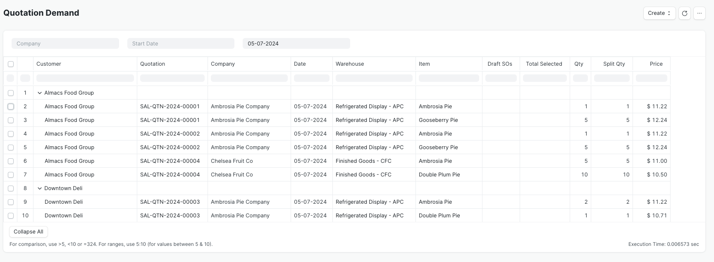
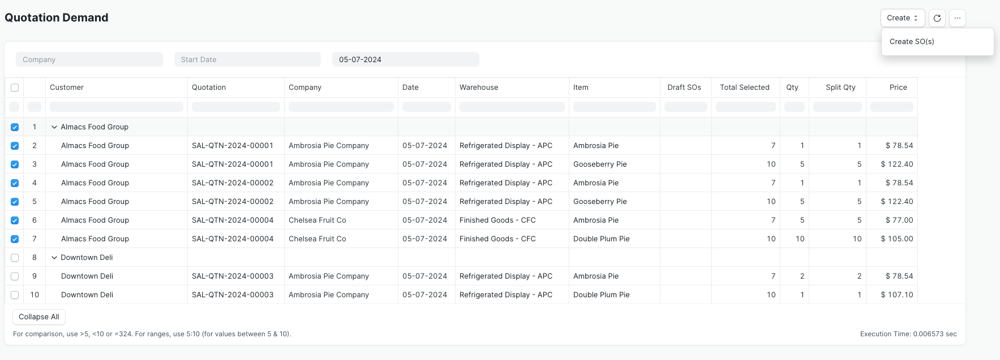

<!-- Copyright (c) 2024, AgriTheory and contributors
For license information, please see license.txt-->

# Quotation Demand

Quotation Demand is a report-based interface that allows you to aggregate required Items across multiple Quotations, Customers, and requesting Companies. From there, you can create draft Sales Orders (SO).

The right-hand side of the report has selection boxes to indicate which rows of Items to include to create the documents. Ticking the top-level customer box will automatically check all the Items for that customer. 

Once you're satisfied with your selections, clicking the Create button will give you the option to generate draft documents:

1. Create SO(s) will create a Sales Order for each customer selected. If there is more than one company requesting items from the same customer, it marks the SO as a Multi-Company Sales Order

All generated documents remain in draft status to allow you to make edits as needed before submitting them.

### Create Sales Orders
If you select the Create SO(s) option, a dialog window will appear to select the Company if it hasn't already been supplied in the filter section.

You can find the new documents in the Sales Order listview.

## Configuration
The Quotation Demand report is available on installation of the Inventory Tools application, but there are configuration options in Inventory Tools Settings to modify its behavior.

When the Quotation Demand report generates Sales Orders, it fills the SO Company field with the company specified in the filter, or if that's blank, the one provided in the dialog window. To retain this default behavior, leave the Sales Order Aggregation Company field in Inventory Tools Settings blank. However, if you populate this field, the report will use its value in the Sales Order's Company field instead. In either case, if there's more than one company requesting materials from the same customer, the report will select the Multi-Company Sales Order box for that customer's SO.

The Aggregated Sales Warehouse field has a similar impact on the report's behavior. By default, the field is blank and the Quotation Demand report applies the warehouses set per Item in the Quotation as the Item's warehouse in the new Sales Order. If you set a value in this field, the report will instead use the specified warehouse for each Item in the Sales Order.

